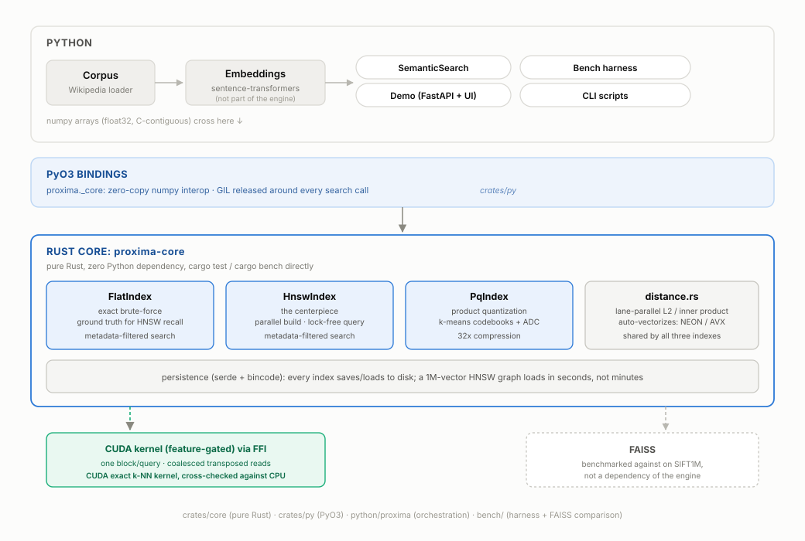
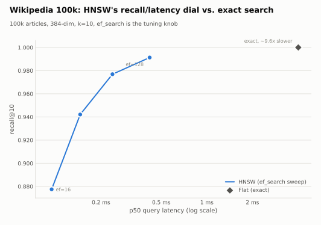
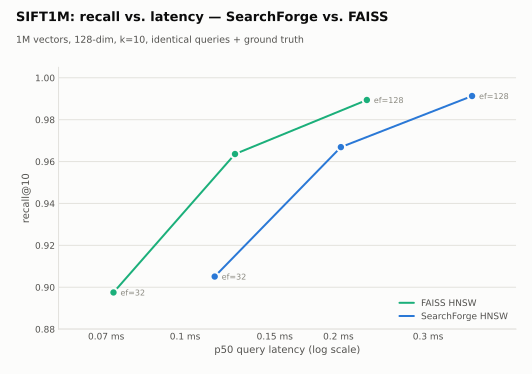

# Proxima

**A from-scratch, GPU-accelerable vector search engine, written in Rust and demonstrated through semantic search.**

> Search by *meaning*, not keywords. Type "a quiet beach town in southern Europe" and get the most semantically similar items from a corpus of millions, in milliseconds. It's the same kind of retrieval that sits underneath vector databases and the RAG layer of most modern AI systems.

Proxima is an **approximate nearest-neighbor (ANN) vector search engine**, built from the ground up. It has a hand-written **HNSW** graph index, an exact brute-force baseline, **product quantization** for memory compression, and a benchmark harness that checks recall, latency, and memory against exact ground truth and head-to-head against [FAISS](https://github.com/facebookresearch/faiss) on SIFT1M, matching its recall at every operating point and tracking its HNSW throughput to within about 10% either way (FAISS still leads clearly on batched exact-flat).

🚀 **[Deploy the demo](docs/DEPLOY.md)** to a free hosted URL.

> **Scope:** this project is the *search infrastructure*: the index, the search algorithms, the systems engineering, and the benchmarking. Embeddings come from an off-the-shelf model (sentence-transformers); training embedding models is **not** part of the project.

---

## Architecture



- **`crates/core`**: the engine, pure Rust, no Python dependency. Directly `cargo test`-able and benchmarkable.
- **`crates/py`**: thin [PyO3](https://pyo3.rs) bindings exposing the engine to Python as `proxima._core` (built with [maturin](https://www.maturin.rs)). Releases the GIL around native search.
- **`python/proxima`**: the Python package for corpus loading, the embedding pipeline, benchmarks, and the demo.

## Status

Built in stages, each one a complete, working index before moving to the next.

| Milestone | What | State |
|-----------|------|-------|
| **M0** | Exact (flat) brute-force search + embeddings + minimal demo, end-to-end | ✅ done |
| **M1** | GPU exact search (CUDA via FFI) + speedup number | ✅ done. **26× over multicore CPU** (46× single-thread) on an RTX 5070, exact |
| **M2** | From-scratch **HNSW** index: recall@10 vs exact, latency | ✅ done (the centerpiece) |
| **M3** | Scale to millions + **product quantization** + FAISS comparison | ✅ done |
| **M4** | Polished demo (1M-scale), README diagram, results tables | ✅ done |

## Results

AMD Ryzen 7 7800X3D (8 cores / 16 threads) · 99k Wikipedia (Simple English) articles · 384-dim embeddings · k=10 · 1,000 held-out queries (excluded from the indexed set, not just from the training set). Recall is measured against the exact flat index (ground truth). p50/p99 are single-query latency; QPS is throughput single-threaded (`1t`) and across all cores (`mt`).

| index | recall@10 | p50 (ms) | p99 (ms) | QPS (1t) | QPS (mt) | mem |
|-------|----------:|---------:|---------:|---------:|---------:|----:|
| Flat (exact) | 1.000 | 4.02 | 4.80 | 228 | 1,139 | 152 MB |
| HNSW `ef=16` | 0.878 | **0.094** | 0.235 | 9,754 | **74,637** | 173 MB |
| HNSW `ef=32` | 0.942 | 0.146 | 0.254 | 7,734 | 68,208 | 173 MB |
| HNSW `ef=64` | 0.977 | 0.238 | 0.362 | 4,314 | 27,012 | 173 MB |
| HNSW `ef=128` | 0.991 | 0.419 | 0.669 | 2,368 | 17,830 | 173 MB |
| HNSW `ef=256` | 0.997 | 0.728 | 1.064 | 1,155 | 10,831 | 173 MB |

**HNSW reaches 97.7% recall@10 at 0.24 ms p50, about 17× faster than exact single-threaded, and sustains 27k QPS at that recall level** (or 75k QPS at 88% recall for the fastest setting). `ef_search` is the recall/latency dial. (Reproduce: `python bench/run_bench.py --corpus data/wiki_simple --ef 16,32,64,128,256 --json bench/results/wiki_simple_100k.json`.)



### SIFT1M: head-to-head vs FAISS

The canonical 1M-vector ANN benchmark (128-dim, **held-out** queries + exact ground truth), run against [FAISS](https://github.com/facebookresearch/faiss) on identical data, queries, and ground truth. AMD Ryzen 7 7800X3D (8 cores / 16 threads), k=10, 1,000 queries.

| index | recall@10 | p50 (ms) | QPS (1t) | QPS (mt) | mem |
|-------|----------:|---------:|---------:|---------:|----:|
| **PX** Flat (exact) | 0.999 | 9.94 | 103 | 158 | 512 MB |
| **PX** HNSW `ef=32` | 0.904 | 0.074 | 13,075 | 84,274 | 685 MB |
| **PX** HNSW `ef=64` | 0.966 | 0.140 | 7,237 | 40,694 | 685 MB |
| **PX** HNSW `ef=128` | 0.991 | 0.257 | 3,969 | 25,547 | 685 MB |
| **PX** PQ `m=16` | 0.538 | 7.67 | 126 | 955 | **16 MB** |
| FAISS Flat | 0.999 | 13.41 | 596 | 782 | 512 MB |
| FAISS HNSW `ef=32` | 0.898 | 0.077 | 14,115 | 77,396 | 656 MB |
| FAISS HNSW `ef=64` | 0.962 | 0.136 | 7,880 | 45,091 | 656 MB |
| FAISS HNSW `ef=128` | 0.988 | 0.251 | 3,950 | 24,019 | 656 MB |
| FAISS PQ `m=16` | 0.532 | 8.13 | 121 | 957 | 16 MB |

**Takeaways:**
- **Recall matches FAISS** at every operating point: Proxima's HNSW graph and PQ codebooks are correct (recall is even marginally higher, e.g. 0.966 vs 0.962 at ef=64).
- **Throughput is at parity, not ahead.** Across all cores the ratio to FAISS is 1.09× at ef=32, 0.90× at ef=64 and 1.06× at ef=128 — it lands on either side of even depending on the operating point, so the honest summary is a tie within noise rather than a win. Each figure is the median of 7 timed passes; a single pass moves them by more than the gap. FAISS keeps a small edge single-threaded.
- **PQ compresses 512 MB down to 16 MB (32×)** with the same recall tradeoff as FAISS PQ.
- **HNSW build is parallelized** across cores (rayon, per-node locking; the query path stays lock-free), finishing the full 1M-vector SIFT index in **43 s** against FAISS's 57 s.
- **Where FAISS still wins, and why:** batched exact-flat throughput. FAISS uses a BLAS GEMM; Proxima uses a straightforward SIMD scan, about 5× slower on that path (782 vs 158 QPS multi-threaded). Single-query flat latency actually favours Proxima (9.9 ms vs 13.4 ms) — the GEMM only pays off once the batch is large. A blocked matmul would close it; it is not a correctness problem.



(Reproduce: `python bench/bench_sift.py --json bench/results/sift1m.json`; regenerate these charts with `python bench/plot_results.py`.)

### GPU exact search (CUDA)

A custom CUDA k-NN kernel (one block per query, base stored transposed for
coalesced reads, block-level top-k reduction) accelerates the exact brute-force
baseline. RTX 5070 vs. Ryzen 7 7800X3D (8 cores / 16 threads), 1M × 128, 2,000 queries,
k=10. Median of three runs on an otherwise idle machine:

| | time | throughput | speedup |
|---|-----:|-----------:|--------:|
| CPU flat, 1 thread | 24.0 s | 83 q/s | 1× |
| CPU flat, all cores | 13.6 s | 147 q/s | 1.8× |
| **GPU exact (CUDA)** | **0.52 s** | **3,851 q/s** | **26.2× / 46.1×** |

The GPU's top-k is cross-checked against the CPU index on every run, with
**exact agreement (1.0000)** since both are exact algorithms, just at different
speeds. (Reproduce on an
NVIDIA machine: `cargo run --release --example gpu_knn --features cuda`; see
[docs/SETUP-GPU.md](docs/SETUP-GPU.md).)

The GPU time is stable to within half a percent run to run; the single-threaded CPU
baseline swings about 10%, which is why these are medians rather than a best-of.
`bench/results/gpu.json` records the device, driver, CPU, and commit for the final run.

## Build & develop

Requires a Rust toolchain and Python 3.9+.

```bash
python3 -m venv .venv && source .venv/bin/activate
pip install maturin
maturin develop --release          # builds proxima._core into the venv

cargo test -p proxima-core         # pure-Rust engine tests
```

### Quick start

```python
import numpy as np
from proxima import FlatIndex, HnswIndex, PqIndex, Metric

vectors = np.random.rand(100_000, 384).astype("float32")
query = np.random.rand(384).astype("float32")

# Exact baseline
flat = FlatIndex(dim=384, metric=Metric.InnerProduct)
flat.add(vectors)
ids, scores = flat.search(query, k=10)

# Approximate HNSW, same interface, ~ms latency at scale
hnsw = HnswIndex(dim=384, metric=Metric.InnerProduct, m=16, ef_search=64)
hnsw.add(vectors)
hnsw.save("index.sfidx"); hnsw = HnswIndex.load("index.sfidx")

# Metadata-filtered search: "nearest neighbors WHERE category = X"
category_ids = np.random.randint(0, 8, size=len(vectors))
mask = category_ids == 3   # bool array, one entry per stored vector
ids, scores = hnsw.search_filtered(query, mask, k=10)
```

### The semantic-search demo

```bash
python scripts/build_corpus.py --limit 1000000 --config 20231101.en --out data/wiki_1m
python scripts/build_index.py  --corpus data/wiki_1m --type hnsw   # persist the graph
make demo                                                          # http://127.0.0.1:8000
```

Type a natural-language query → semantically ranked Wikipedia results + the live index-search latency. Median index-search latency over 1M articles stays **under a millisecond** (the graph is warmed at startup); embedding the query itself takes longer than the search. With no corpus built, `make corpus` builds a quick 100k Simple-English set.

### Reproduce the benchmarks

```bash
python bench/run_bench.py  --corpus data/wiki_simple   # HNSW vs exact (recall/latency sweep)
python bench/bench_sift.py                             # Proxima vs FAISS on SIFT1M
```

`bench_sift.py` needs the SIFT1M corpus, which isn't bundled (168 MB compressed). Fetch it once:

```bash
mkdir -p data/sift
curl -o data/sift/sift.tar.gz ftp://ftp.irisa.fr/local/texmex/corpus/sift.tar.gz
tar -xzf data/sift/sift.tar.gz -C data/sift   # -> data/sift/sift/*.fvecs
```

## Project layout

```
crates/core/src/   distance.rs · flat.rs · hnsw.rs · pq.rs · metric.rs   (the engine)
crates/py/src/     lib.rs                                                (PyO3 bindings)
python/proxima/    embeddings · corpus · store · search                (orchestration)
bench/             harness · run_bench · bench_sift · faiss_compare · datasets
demo/              app.py + static/index.html                            (FastAPI + UI)
scripts/           build_corpus · build_index · search_cli
tests/             Python binding tests (Rust unit tests live in crates/core)
```

## License

MIT
